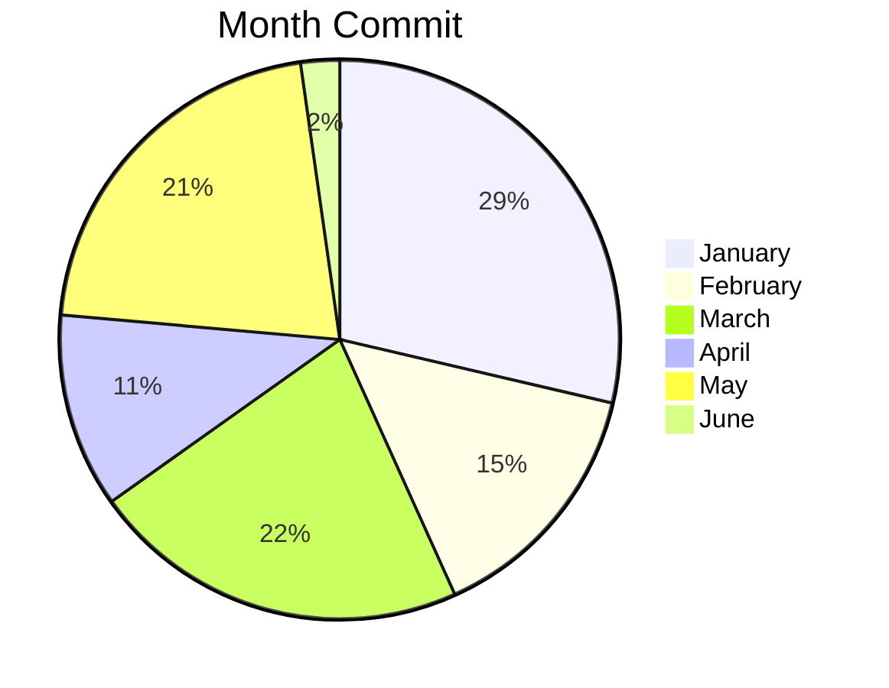
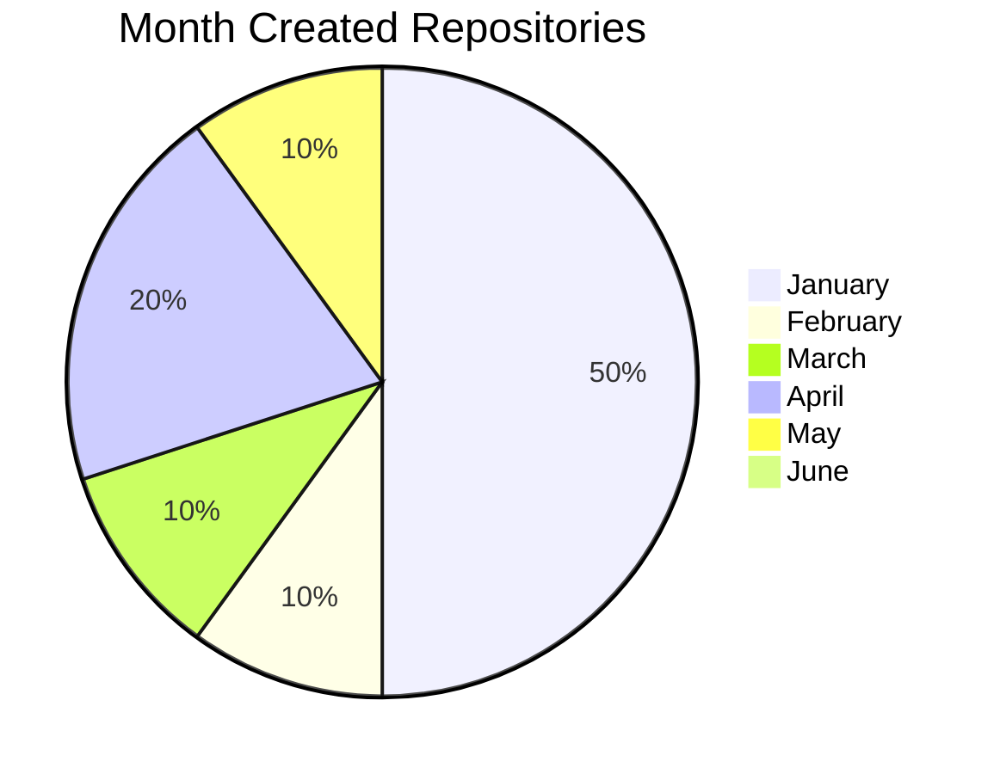

# WOC [ 2023 ]
Week Of Commit - 한달간에 커밋과 레포 생성수를 그래프로 표현한 레포지토리 
( 1년마다 초기화 됩니다. 데이터는 파일( 2022.md ) 형식으로 저장할 예정 )
|커밋한 달|커밋수|만든 레포수|
|------|---|---|
|January|101|5|
|February|26|1|
|March|39|1|
|April|20|2|
|May|38|1|
|June|4|0|

