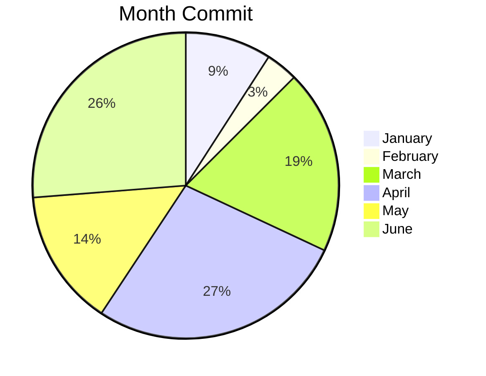
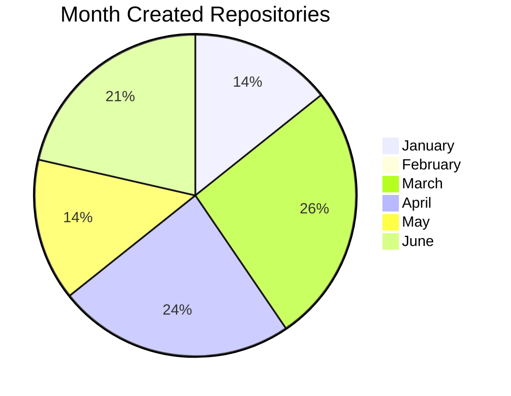

# WOC
Week Of Commit - 한달간에 커밋과 레포 생성수를 그래프로 표현한 레포지토리 
( 1년마다 초기화 됩니다. 데이터는 파일( 2022.md ) 형식으로 저장할 예정 )
|커밋한 달|커밋수|만든 레포수|
|------|---|---|
|January|51|6|
|February|19|0|
|March|109|11|
|April|153|10|
|May|81|6|
|June|147|9|

